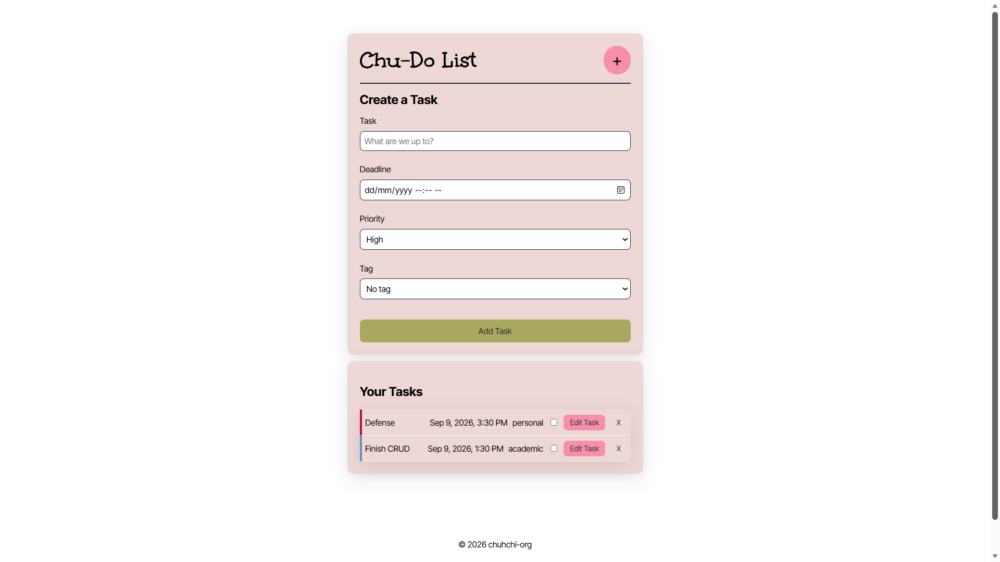
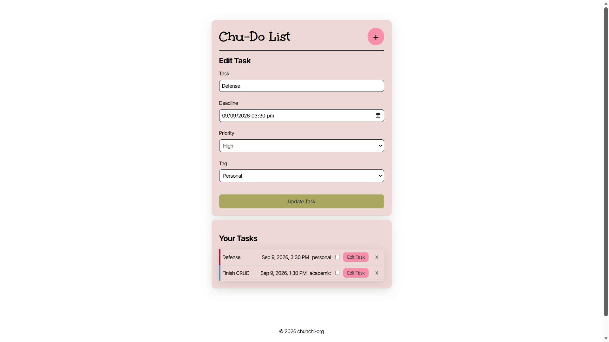
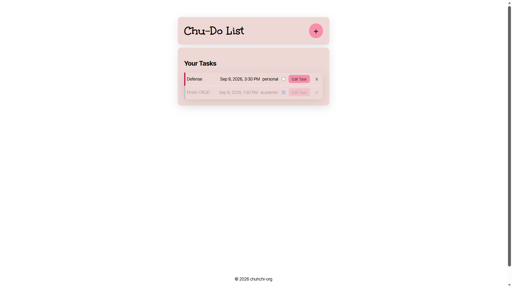
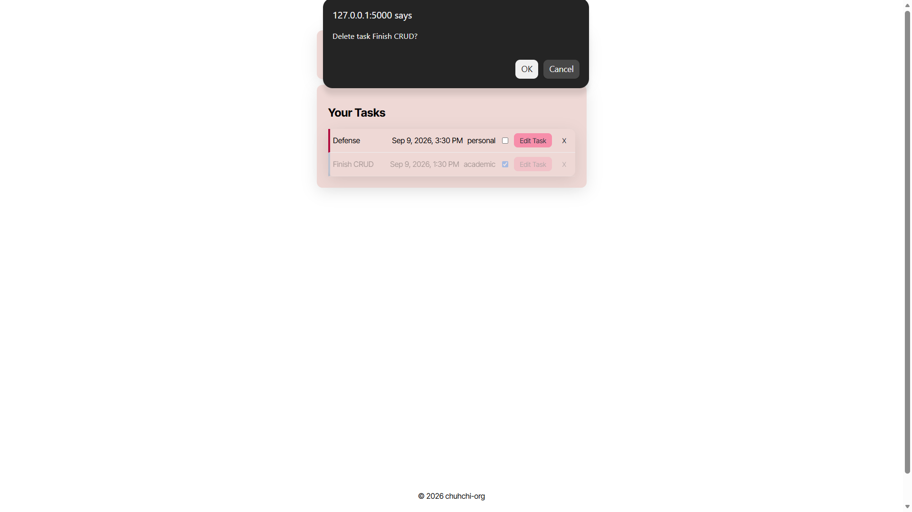
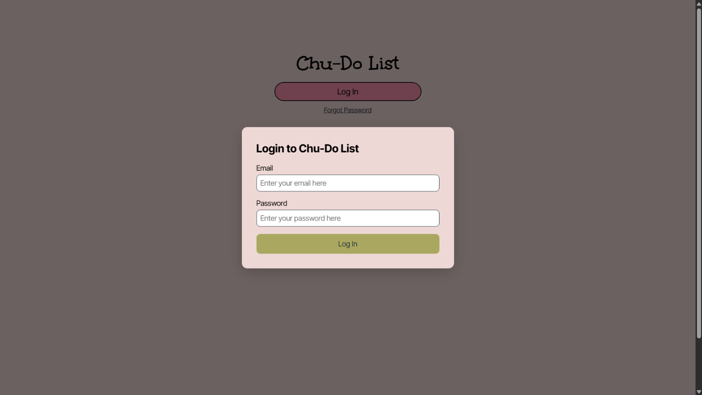
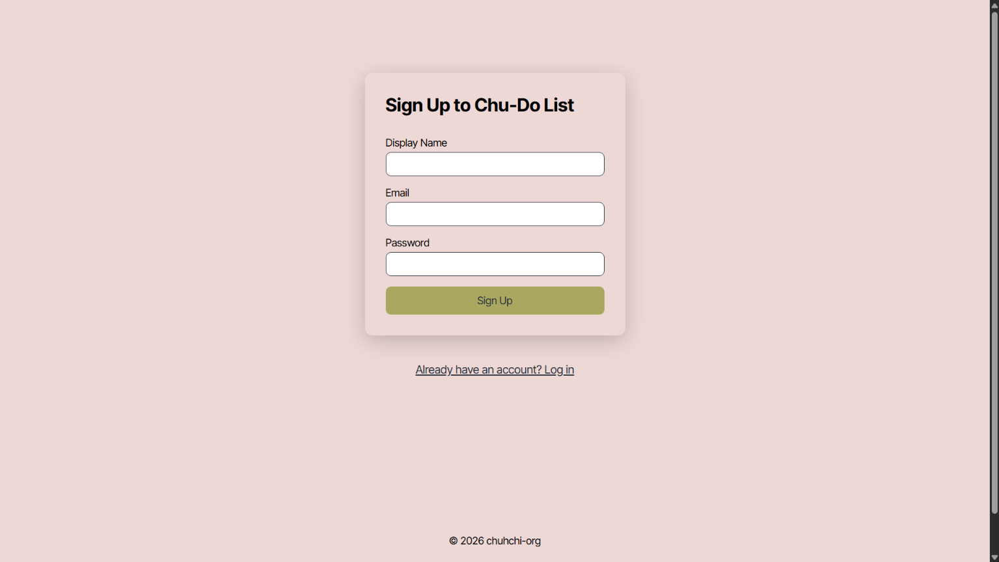
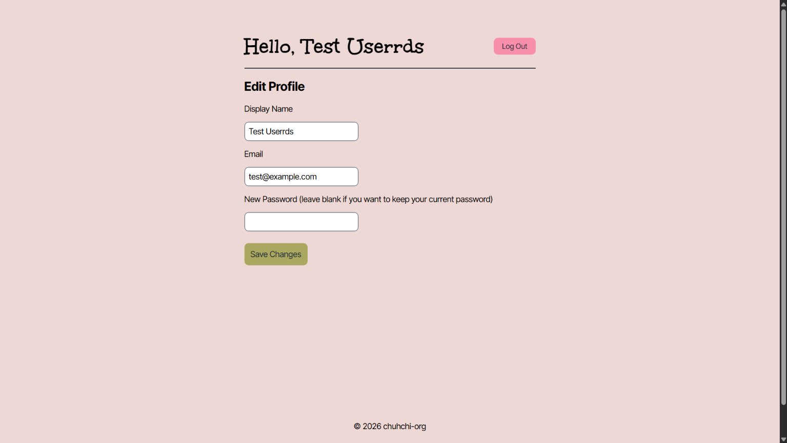
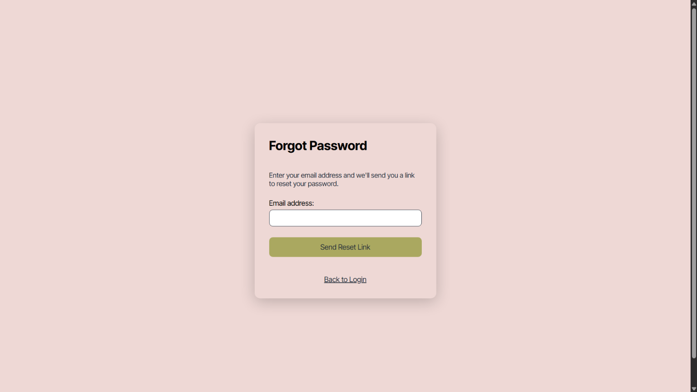

# Chu-Do List

Authors:
    
Seth Leander L. Caballero

Ryona Cassandra P. Honrado

## Overview
Hello, World! Chu-Do List is a simple and light-weight to-do list web application for you and for me and for the entire human race!

**Implemented features:**
- Task CRUD (create, read, update, delete), done-status toggling, priority/tag tagging (Lab 1)
- Account registration, login, logout, and persistent sessions (Lab 2)
- Profile page to update display name, email, and password (Lab 2)
- Password recovery via a local/demo token-based flow (Lab 2)

### Tech Stack
Our chosen tech stack is:
- HTML
- CSS
- JavaScript
- Flask (Python)
- SQLite (Database)

We chose this tech stack because it fits the scale of this lab. The entire request can be traced end-to-end — from a button click, through `fetch()`, through a Flask route, to raw SQL, and then back, without any ORM or framework abstraction obscuring what's actually happening. This transparency made debugging and understanding our own code straightforward throughout development.

This stack also had a low learning curve for us: we already had experience with HTML, CSS, and JavaScript; SQLite's SQL syntax is similar to MySQL, which we were already familiar with; and Flask, being Python-based, let us focus on learning the framework itself rather than a new language at the same time.

**Additional libraries used for Lab 2:**
- `werkzeug.security` (bundled with Flask) — `generate_password_hash` / `check_password_hash` for secure, salted password hashing and verification. Used instead of writing custom hashing, since rolling your own is a well-known security anti-pattern.
- `python-dotenv` — loads `SECRET_KEY` from a local `.env` file into the environment at startup, so Flask's signed session cookies work without hardcoding a secret into source code.
- `secrets` (Python standard library) — generates cryptographically secure password-reset tokens (`secrets.token_urlsafe(32)`), chosen over the `random` module specifically because `random` is not safe for security-sensitive values.

### Authentication Approach

- **Password storage:** passwords are never stored in plain text. `generate_password_hash` salts and hashes each password before it's written to the `users` table; `check_password_hash` verifies a login attempt against the stored hash without ever reversing it.
- **Session handling:** a successful login stores the user's id in Flask's `session`, a cookie signed using `SECRET_KEY` (loaded from `.env`, never committed). Because the key is fixed on disk rather than regenerated per run, existing sessions remain valid across backend restarts — this is what keeps a logged-in user logged in after a refresh, browser back/forward, or a server restart, rather than relying on a temporary in-memory variable.
- **Route protection:** the main to-do list route checks for a valid `session["user_id"]` before rendering; if absent, the user is redirected to `/login` instead of seeing protected content.
- **Logout:** `session.clear()` invalidates the session server-side immediately, rather than just hiding UI client-side.
- **Error messaging:** login and password-recovery failures return generic, identical messages regardless of whether the email exists or the password was wrong — this prevents the app from being used to check which emails are registered (user enumeration).

### Password Recovery Mechanism (Local/Demo)

A live email-delivery service (e.g. SMTP, SendGrid) was intentionally omitted for local development, per the lab's allowance for a documented local/demo recovery flow. Instead:

1. The user submits their email on the Forgot Password form.
2. If a matching account exists, the backend generates a cryptographically secure token (`secrets.token_urlsafe(32)`) and a 5-minute expiry, storing both on the user's row (`reset_token`, `reset_token_expiry`).
3. Instead of emailing the token, the developers check the database if the token and token expiry are updated into the user's columns.
4. Regardless of whether the email existed, the same generic success response is returned, so the endpoint can't be used to enumerate registered accounts.
5. Visiting the reset link re-verifies the token and its expiry before allowing a new password to be set; on success, the token is cleared so it cannot be reused, and the old password immediately stops working.

**Limitation:** since no real email is sent, this flow is not suitable for production use as-is — a real deployment would replace the console `print()` with an actual transactional email call (e.g. via SMTP or a service like SendGrid), with the token delivered only to the account owner's actual inbox rather than visible to whoever has terminal/log access.

## How to Run the App Locally

### Prerequisites
- Python 3.13 (or compatible 3.x) installed
- Git (to clone the repo)

### Setup

1. **Clone the repository**
   ```powershell
   git clone <repo-url>
   cd cmsc128-Lab1_CRUD_caballero_honrado
   ```

2. **Create and activate a virtual environment**
   ```powershell
   py -3.13 -m venv venv
   .\venv\Scripts\Activate.ps1
   ```
   If PowerShell blocks the activation script with an execution policy error, run this once per session first:
   ```powershell
   Set-ExecutionPolicy -Scope Process -ExecutionPolicy Bypass
   ```

3. **Install dependencies**
   ```powershell
   pip install -r requirements.txt
   ```

4. **Set up environment variables (required for Lab 2)**

   Create a `.env` file in the project root (see `.env.example` for the expected variable names) containing:
   ```
   SECRET_KEY=<a long random string>
   ```
   Generate one with:
   ```powershell
   python -c "import secrets; print(secrets.token_hex(32))"
   ```
   This key signs session cookies; without it, Flask raises an error the moment login/logout is used. `.env` is gitignored — each developer generates and keeps their own.

5. **Run the app**
   ```powershell
   cd backend
   python app.py
   ```
   On first run, this automatically creates `tasks.db` in the `backend/` folder with the required schema (including the `users` table) — no manual database setup needed, since SQLite ships with Python's standard library.

6. **Open the app**

   Visit `http://127.0.0.1:5000/` in your browser. Logged-out visitors are redirected to `/login`.

### Notes
- `tasks.db`, `venv/`, and `.env` are excluded from version control (`.gitignore`) — each developer has their own local database file and secret key.
- The server runs with `debug=True` for local development, enabling auto-reload on file changes and detailed error tracebacks.
- **Database inspection:** [tool name/extension used — e.g. DB Browser for SQLite] is used to inspect the `users` table during the defense, confirming `password_hash` and `reset_token` are stored as hashed/opaque values rather than plaintext.

---

## API Endpoints (CRUD Operations)

All endpoints are served locally at `http://127.0.0.1:5000`.

### `GET /tasks`
Returns all tasks currently stored in the database.

**Response** — `200 OK`
```json
[
    {
        "id": 1,
        "title": "Buy milk",
        "due_datetime": "2026-09-10T10:00",
        "priority": 1,
        "tag": "errand",
        "is_done": 0,
        "created_at": "2026-09-09T08:00"
    }
]
```

### `POST /tasks`
Creates a new task.

**Request body**
```json
{
    "title": "Buy milk",
    "due_datetime": "2026-09-10T10:00",
    "priority": 1,
    "tag": "errand",
    "created_at": "2026-09-09T08:00"
}
```

**Response** — `201 Created`
```json
{
    "id": 1,
    "title": "Buy milk",
    "due_datetime": "2026-09-10T10:00",
    "priority": 1,
    "tag": "errand",
    "created_at": "2026-09-09T08:00",
    "is_done": 0
}
```
*(`is_done` is always set to `0` server-side for new tasks, client is not asked to manually input it.)*

### `PUT /tasks/<int:task_id>`
Updates an existing task by id.

**Request body**
```json
{
    "title": "Buy milk and eggs",
    "due_datetime": "2026-09-10T10:00",
    "priority": 1,
    "tag": "errand",
    "is_done": 1
}
```

**Response** — `200 OK`
```json
{
    "status": "updated",
    "id": 1
}
```

### `DELETE /tasks/<int:task_id>`
Deletes a task by id.

**Response** — `200 OK`
```json
{
    "status": "deleted",
    "id": 1
}
```
---

## API Endpoints (Authentication & Account Management)

### `POST /signup`
Creates a new account. Rejects missing fields, malformed emails, short passwords, and duplicate emails with descriptive error messages.

**Request body**
```json
{
    "display_name": "Test User",
    "email": "test@example.com",
    "password": "testpassword123"
}
```

**Response** — `201 Created`
```json
{
    "id": 1,
    "display_name": "Test User",
    "email": "test@example.com"
}
```

**Error response** — `400` (validation) or `409` (duplicate email)
```json
{ "error": "An account with this email already exists." }
```

### `POST /login`
Verifies credentials and starts an authenticated session.

**Request body**
```json
{ "email": "test@example.com", "password": "testpassword123" }
```

**Response** — `200 OK`
```json
{ "id": 1, "display_name": "Test User" }
```

**Error response** — `401 Unauthorized` (identical message whether the email doesn't exist or the password is wrong)
```json
{ "error": "Wrong email or password" }
```

### `POST /logout`
Clears the current session.

**Response** — `200 OK`
```json
{ "status": "logged_out" }
```

### `GET /profile`
Renders the Profile page, pre-filled with the logged-in user's current `display_name` and `email`. Requires an active session.

### `PUT /profile`
Updates the logged-in user's display name, email, and (optionally) password. Only fields the user actually changed need to be sent — password is omitted from the request entirely if left blank. Identifies the account via the session cookie rather than a request parameter.

**Request body**
```json
{
    "display_name": "New Name",
    "email": "new@example.com",
    "password": "optionalNewPassword123"
}
```

**Response** — `200 OK` on success, or an error object describing the validation issue (e.g. duplicate email) otherwise.

### `POST /forgot-password`
Requests a password reset for the given email. Always returns the same generic response, whether or not the email is registered, to prevent account enumeration. In this local/demo setup, the reset token is printed to the server console rather than emailed.

**Request body**
```json
{ "email": "test@example.com" }
```

**Response** — `200 OK`
```json
{ "message": "If an account with that email exists, a password reset link has been sent." }
```

### `GET /reset-password/<token>`
Renders the "set new password" form if the token is valid and unexpired (tokens expire 5 minutes after being issued); otherwise shows an invalid/expired state.

### `POST /reset-password/<token>`
Re-verifies the token and expiry, hashes and stores the new password, and clears the token so it cannot be reused.

**Request body**
```json
{ "password": "myNewPassword123" }
```

**Response** — `200 OK` on success, or an error if the token is invalid/expired.


## Screenshots

### Task Creation


### Edit Task


### Mark as Done


### Task Deletion


### Login


### Signup


### Profile Page


### Password Recovery
